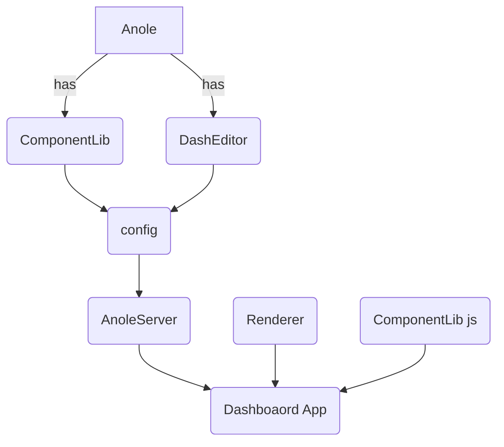

# 产品实现设计
## 架构设计

#### 概述
* Layout 展示及布局组件, 描述面板展示内容
* MessageCallBack 消息通信保障
* Renderer Layout 的渲染引擎, 由Layout 数据驱动, 输入Layout 数据, 输出Dom
* DashEditor 面板交互式的编辑器, 生成Layout 及 MessageCallBack 


#### 整体功能架构图



#### 整体技术架构图
#### Layout 数据结构及标准


```
Demo1  children 为展示内容, Div 通常为父节点
{
    "type": "Div",
    "namespace": "dash_html_components",
    "props": {
        "children": "Div 展示内容",
    }
}

Demo2 嵌套输出, children 为嵌套内容
{
    "type": "Div",
    "namespace": "dash_html_components",
    "props": {
        "children": [
            {
                "props": {
                    "children": "Hello Dash"
                },
                "type": "H1",
                "namespace": "dash_html_components"
            },
            {
                "props": {
                    "children": "div text"
                },
                "type": "Div",
                "namespace": "dash_html_components"
            },
            {
                "props": {
                    "id": "example-graph",
                    "figure": {
                        "layout": {
                            "xaxis": {},
                            "yaxis": {}
                        },
                        "data": []
                    }
                },
                "type": "Graph",
                "namespace": "dash_html_components"
            },
        ],
    }
}
```


#### MessageCallBack 数据结构及标准
#### Renderer 模块及时序图

[模块及时序图]( /doc/renderer-erd.md )

#### DashEditor 模块及时序图
#### 数据库表设计

 


