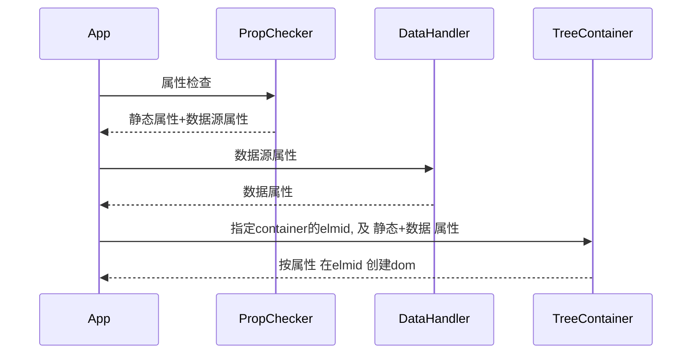
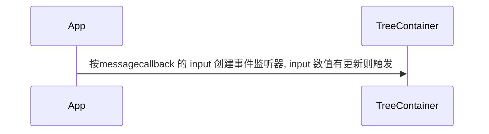

## Renderer 设计
### 模块组成
* treecontainer : layout to dom 
* PropChecker: 属性检查器
* DataHandler: 数据源
* messagecallback: 消息事件

### 时序图

1. dom renderer 

```mermaid
sequenceDiagram
    participant App
    participant PropChecker
    participant DataHandler
    participant TreeContainer
    App->> PropChecker: 属性检查
    PropChecker -->> App: 静态属性+数据源属性
    App ->> DataHandler: 数据源属性
    DataHandler -->> App: 数据属性
    App->>TreeContainer: 指定container的elmid, 及 静态+数据 属性
    TreeContainer-->>App: 按属性 在elmid 创建dom

```

2. messagecallback

```mermaid
sequenceDiagram
    participant App
    participant TreeContainer
    App ->> TreeContainer: 按messagecallback 的 input 创建事件监听器, input 数值有更新则触发
```
